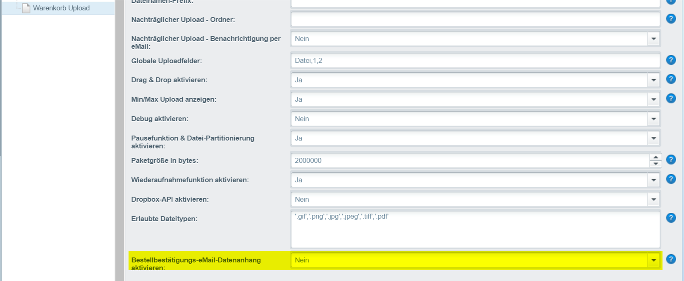

# Bestellbestätigungs-eMail Datenanhang aktivieren

Die übertragenen Daten werden in der Bestellbestätigungs-eMail in den Anhang eingefügt.

<figure><figcaption>
Einstellungen
</figcaption></figure>
