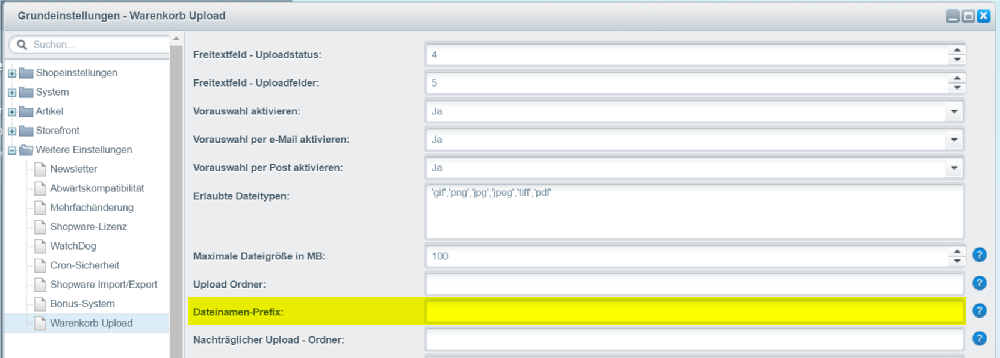

# Dateinamen Präfix definieren

Setzen Sie automatisch **vor** jeden Dateinamen ein definierten String.

Mit den folgenden Variablen können Sie den Präfix definieren.

```
$customernumber = Kundennummer
$year = Jahr
$month = Monat
$day = Tag
```

### Beispiel 1 - Bestellnummer <a href="#beispiel_1" id="beispiel_1"></a>

```
$customernumber
```

Ergebnis: 20003\_Dateiname

### Beispiel 2 - Datum <a href="#beispiel_2" id="beispiel_2"></a>

```
$year$month$day
```

Ergebnis: 20170327\_Dateiname

<figure><figcaption><p>Einstellungen</p></figcaption></figure>
