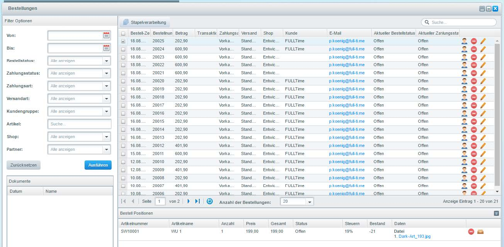
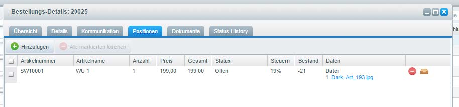

# Daten abholen

Öffnen Sie dazu die Bestellungen im Backend. Wählen Sie eine Bestellung aus und gehen Sie dann in die Bestellungs-Details. Im Reiter Positionen gibt es nun eine weitere Spalte „Daten“. Dort können Sie direkt über ein Link die Daten abholen.

<figure><figcaption>
Bestellungen
</figcaption></figure>

<figure><figcaption>
Positionen
</figcaption></figure>
