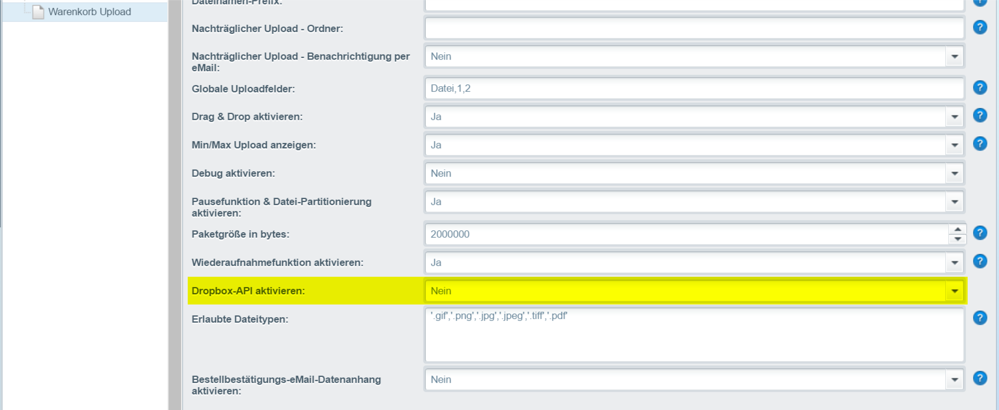

# Dropbox-API aktivieren

Bieten Sie Ihren Kunden an die Daten über Dropbox zu übertagen.


Beachten Sie das es notwendig ist das diese Funktion extra freizugeben ist. Senden Sie mir bitte dazu eine eMail mit der Shopdomain an support@fulltime-ecommerce.de


<figure><figcaption>
Einstellungen
</figcaption></figure>
