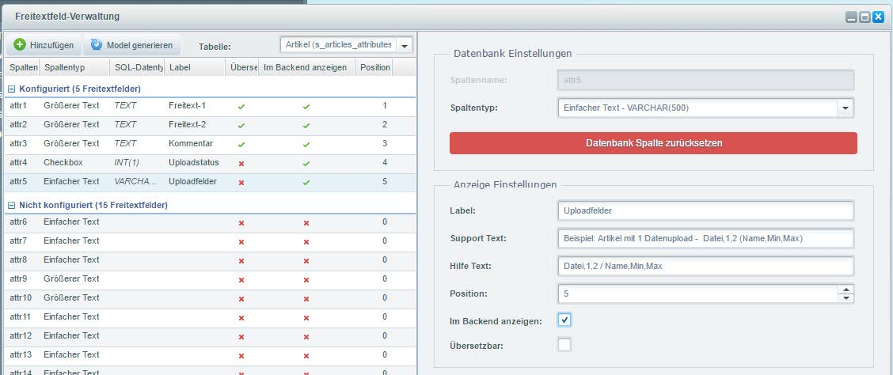
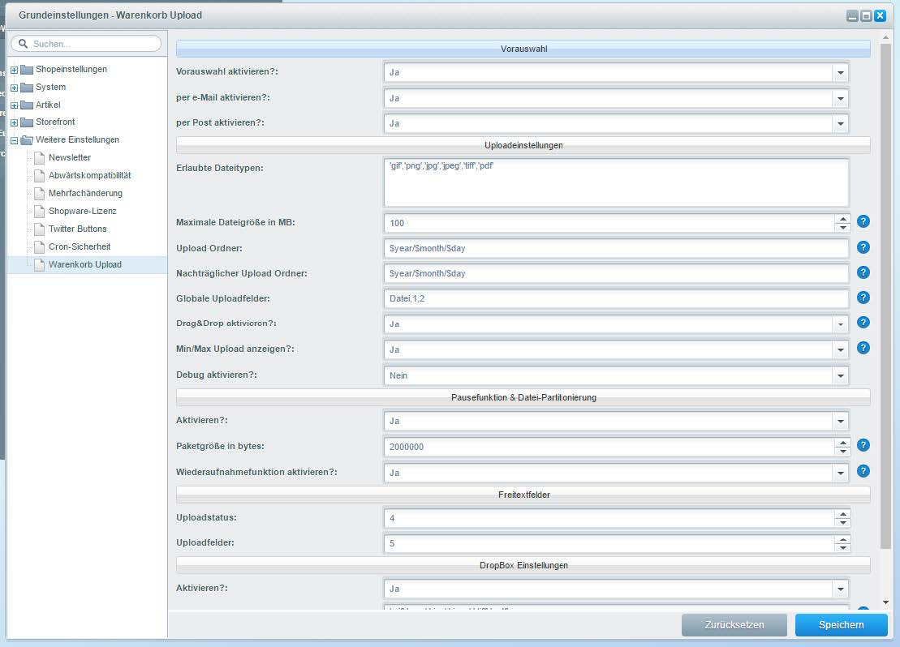

# Freitextfelder und Plugin Konfiguration

### Freitextfelder 

Hier finden Sie eine Anleitung wie Sie die Freitextfelder und das Plugin konfigurieren.

Öffnen Sie bitte im Backend die Freitextfeld-Verwaltung. Es sollte danach direkt die Tabelle Artikel (s\_articles\_attributes) gewählt sein. In dieser Konfiguration wird das attr4 und attr5 Feld genutzt.

Insofern diese bei Ihnen belegt sind können auch gern andere genutzt werden. Diese müssen dann in den Plugin Einstellungen hinterlegt werden.

Klick Sie auf attr4. Im rechten Formular geben Sie folgendes ein.

* Spaltenname: attr4
* Spaltentyp: Checkbox – INT(1)
* Label: Uploadstatus&#x20;
* Support Text: Upload für diesen Artikel aktivieren&#x20;
* Position: 4&#x20;
* Im Backend anzeigen: aktiv

Klicken Sie danach auf attr5. Im rechten Formular geben Sie folgendes ein.

* Spaltenname: attr5&#x20;
* Spaltentyp: Einfacher Text – VARCHAR(500)&#x20;
* Label: Uploadfelder&#x20;
* Support Text: Beispiel: Artikel mit 1 Datenupload - Datei,1,2 (Name,Min,Max)&#x20;
* Hilfe Text: Datei,1,2 / Name,Min,Max&#x20;
* Position: 5&#x20;
* Im Backend anzeigen: aktiv
*

    <figure><figcaption>
Freitextfelder
</figcaption></figure>

### Plugin Konfiguration 

Gehen Sie bitte in die Plugin-Konfiguration und stellen Sie dort alle gewünschten Werte ein. Es werden alle wichtigen Felder dort erklärt.


Es müssen 2 Werte in Ihrer php.ini angepasst werden: post\_max\_size / upload\_max\_filesize


Diese Definition richtet sich nach den Einstellungen im Plugin unter Maximale Dateigröße in MB. Falls Sie nicht wissen wo Sie ihre php.ini finden, dann beauftragen Sie bitte Ihren aktuellen Hoster damit.

<figure><figcaption>
Einstellungen
</figcaption></figure>

