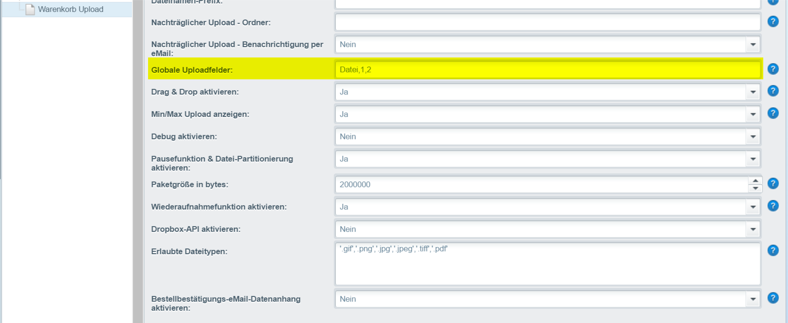

# Globales Uploadfeld

Dieser Wert gilt für alle Artikel. Wenn Sie ein anderen Wert definieren wollen, können Sie dies direkt im Artikel. Der Upload selbst muss im Artikel aktiviert werden.


Dieser Wert greift nur wenn im Artikel das Feld "Uploadfelder" leer ist!


* Name = Bezeichnung im Frontend
* Min = Es müssen mindestens die angegebenen Uploads übertragen werden
* Max = Es dürfen maximal die angegebenen Uploads übertragen werden

### Beispiel 1 <a href="#beispiel_1" id="beispiel_1"></a>

Artikel mit mindestens 1 Upload und maximal 2 Uploads

```
Datei,1,2
```

### Beispiel 2

Artikel mit 2 Dateien. Datei 1 hat mindestens 1 Upload und maximal 2 Uploads. Datei 2 ohne notwendigen Upload und maximal 1 Uploads

```
Datei 1,1,2;Datei 2,0,1
```

### Beispiel 3 <a href="#beispiel_3" id="beispiel_3"></a>

Ohne notwendigen Upload und maximal 2 Uploads

```
Datei,0,2
```

<figure><figcaption><p>Einstellungen</p></figcaption></figure>
