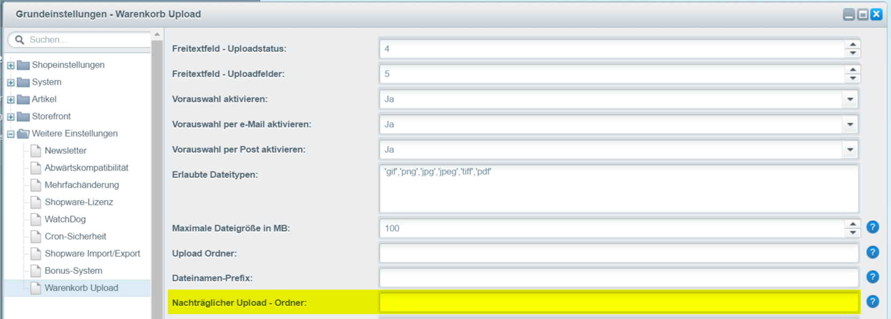

# Upload Ordner definieren


Der Hauptordner ist auf **files/subUploads** definiert.


Mit den folgenden Variablen können Sie die Ordnerstruktur erweitern

```
$year = Jahr
$month = Monat
$day = Tag
```

### **Beispiel**

```
$year/$month/$day
```

Ergebnis: files/basketUploads/2017/03/27

<figure><figcaption><p>Einstellungen</p></figcaption></figure>
