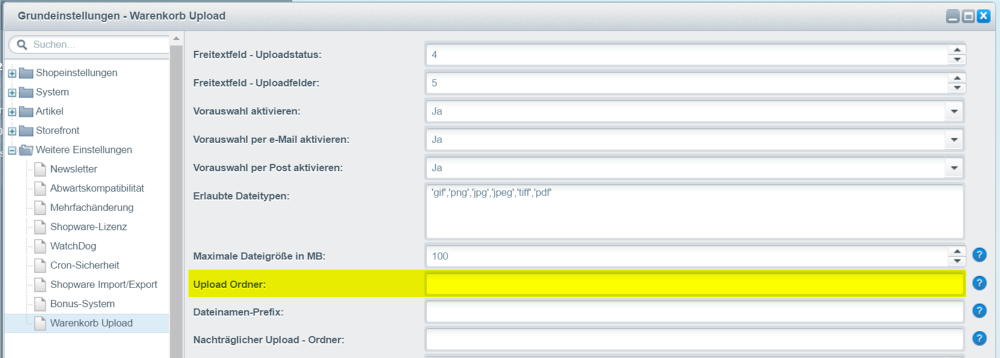

# Upload Ordner definieren


Der Hauptordner ist auf **files/basketUploads** definiert


Mit den folgenden Variablen können Sie die Ordnerstruktur erweitern.

```
$ordernumber = Bestellnummer
$customernumber = Kundennummer
$year = Jahr
$month = Monat
$day = Tag
```

### Beispiel 1 - Bestellnummer <a href="#beispiel_1" id="beispiel_1"></a>

```
$ordernumber
```

Ergebnis: files/basketUploads/20003

### Beispiel 2 - Datum <a href="#beispiel_2" id="beispiel_2"></a>

```
$year/$month/$day
```

Ergebnis: files/basketUploads/2017/03/27

<figure><figcaption><p>Einstellungen</p></figcaption></figure>
