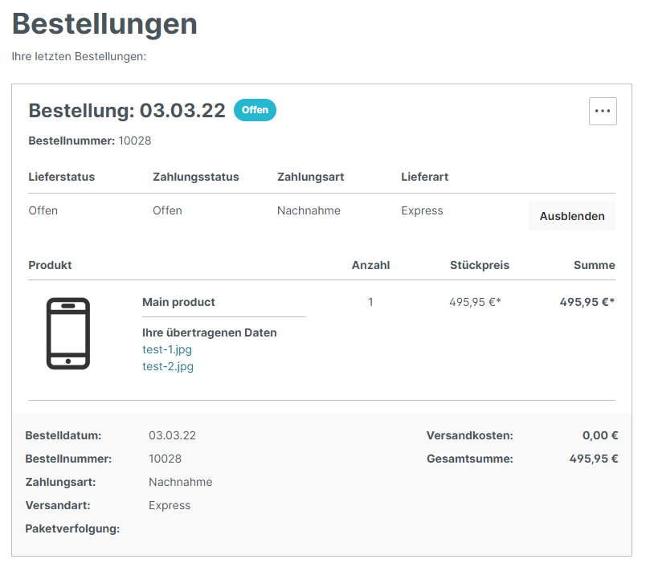

# Version 1.1.3

Es wurden die übertragenen Daten (Uploads) in die Bestellübersicht des Kunden integriert.

Die Auflistung dieser Daten wurde unterhalb des Produktnamens hinzugefügt.

Für den Titel über der Auflistung wurde folgender Textbaustein hinzugefügt: **futi-cu.account-order-item-detail-title**

<figure><figcaption></figcaption></figure>

