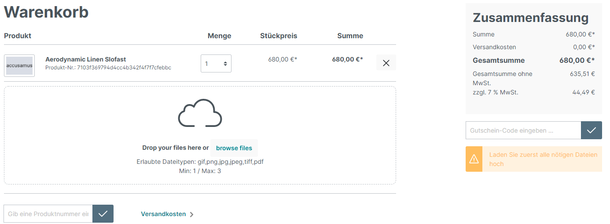

# Artikel

Öffnen Sie im Shopware-Admin ein Artikel der im Warenkorb ein Upload haben soll. Scrollen Sie danach bis zu den Zusatzfelder. Wählen Sie dann dort den Reiter "Warenkorb Upload".

1. Aktivieren sie den Upload für den Artikel
2. Definieren Sie ein minimalen Upload
3. Definieren Sie ein maximalen Upload\
   Beim erreichen des maximalen Uploads wird die Upload-Funktion entfernt

Insofern der minimale Upload im Warenkorb nicht erreicht wird wird der "Zur Kasse" Button bzw. "Zahlungspflichtig bestellen" Button durch eine Information ersetzt. Diesen Text können Sie über die Textbausteine übersetzen.


Textbaustein: futi-cu.upload-info-text


<figure><figcaption></figcaption></figure>

