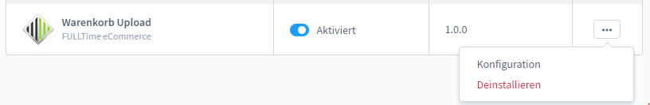

# Erweiterung

Öffnen Sie Einstellungen->System->Plugins. Klicken Sie recht auf die 3 Punkte neben dem Plugin "Warenkorb Upload" und öffnen Sie die Konfiguration.

<figure><figcaption>
Erweiterung konfigurieren
</figcaption></figure>

Nachfolgend können Sie die Einstellungen entweder für alle oder einzelne Verkaufskanäle definieren.

**Erlaubte Dateitypen**\
Hinterlegen Sie hier die erlaubten Dateitypen. Beachten Sie die korrekte Definition. Bsp.: 'gif','png','jpg'

**Maximale Dateigröße in MB**\
Definieren Sie hier die maximale Dateigröße in MB. Es müssen 2 Werte in Ihrer php.ini angepasst werden: post\_max\_size / upload\_max\_filesize. Diese 2 Werte müssen der hier definierten maximalen Dateigröße entsprechen. Falls Sie nicht wissen wo Sie ihre php.ini finden, dann beauftragen Sie bitte Ihren aktuellen Hoster damit.

**Debug**\
Dies sollte im Livebetrieb deaktiviert werden
