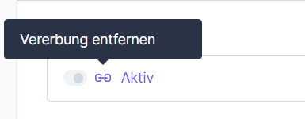

# Aktivierung pro Verkaufskanal


Verfügbar ab Version 1.2.0


In der Konfiguration der Erweiterung können Sie festlegen, welche Verkaufskanäle ein Warenkorb-Upload anzeigen soll.

1. Öffnen Sie dazu die Konfiguration und wählen Sie zunächst den Verkaufskanal aus.

<figure><figcaption></figcaption></figure>

2. Als nächstes entfernen Sie die Vererbung für die Einstellung "Aktiv".

<figure><figcaption></figcaption></figure>

3. Aktivieren Sie nun die Einstellung für diesen Verkaufskanal.

<figure><figcaption></figcaption></figure>

