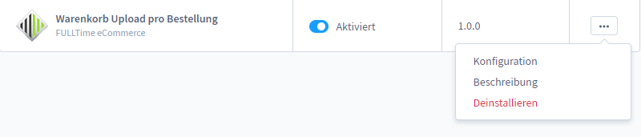

# Erweiterung

Öffnen Sie Einstellungen->System->Plugins. Klicken Sie recht auf die 3 Punkte neben dem Plugin "Warenkorb Upload pro Bestellung" und öffnen Sie die Konfiguration.

<figure><figcaption></figcaption></figure>

Nachfolgend können Sie die Einstellungen entweder für alle oder einzelne Verkaufskanäle definieren.

| Feld                                              | Beschreibung                                                                                                                                                                                                                                                                                                                                                       |
| ------------------------------------------------- | ------------------------------------------------------------------------------------------------------------------------------------------------------------------------------------------------------------------------------------------------------------------------------------------------------------------------------------------------------------------ |
| 
Erlaubte Dateitypen

 

 
  | 
Hinterlegen Sie hier die erlaubten Dateitypen. Beachten Sie die korrekte Definition.

Bsp.: 'gif','png','jpg'

 
                                                                                                                                                                                                                               |
| 
Maximale Dateigröße in MB  
          | 
Definieren Sie hier die maximale Dateigröße in MB.

Es müssen 2 Werte in Ihrer php.ini angepasst werden: post_max_size / upload_max_filesize. Diese 2 Werte müssen der hier definierten maximalen Dateigröße entsprechen.

Falls Sie nicht wissen wo Sie ihre php.ini finden, dann beauftragen Sie bitte Ihren aktuellen Hoster damit.

 
 |
| 
Maximaler Upload pro Bestellung

 
 | Definieren Sie hier die maximale Dateianzahl pro Bestellung.                                                                                                                                                                                                                                                                                                       |
| Debug                                             | Dies sollte im Livebetrieb deaktiviert sein.                                                                                                                                                                                                                                                                                                                       |
